# Lab 7 ECE 140A
### Amber Szulc (A16241551)
### Mike Liu (A15409210)


## Tutorial 1
First we connect arucam to usb of raspberry pi. Then import cv2 on it.
Then run ISUSB and take a picture with your camera. Saving the image as test.jpg

## Tutorial 2

Install pytesseract to extract text from an image. First blur filers gets out high frequency noise. Then binary threshold keeps edges. Inversion swithces black and white colors by subracting pixel intensity from max. Dilation enlarge fragments.
Then we group together pixels with similar color by the largest 15 contouring groups. We approximate polygons by storing corners of polygons, then we shape them into a rectangle and rotate.
Finally, we work on rextracting the image into a 9 by 9 block. Send box to pytesseract image string to get test.

## Challenge 1
In this challenge we had to implement a car lisence plate detector with a RESTful website structure. The implementation of the website was not difficult, much of it was boiler plate or reusable code from previous labs, but we ran into a headway when it came down to image processing. Our image preproccessing was implemented from Tutorial 2, we only modified minor parts to it in order to get the format of our new lisence plates, which some plates were behaving strangely. Of our iterations and testing, plates would at times rotate or present a mirror image, worst was uncessary zoom to a character that we have not specified. Various thresholding and noise reducing algorithms were used but most of them are hacks and we thought is unsuitable in the theme of this assignment. In this part, most of our troubles came from Arizona_47.png, since the plate edges blend into the background on most Gaussian blurs we had to admit that the specific algorithm does not work well with a light background on a bright plate. The solution would be Canny Edge Detection, but that ran into a host of problems with OpenCV that we were unable to implement it correctly. As a result, we stuck with Gaussian blur, which does very well in contrast imaging as shown below.
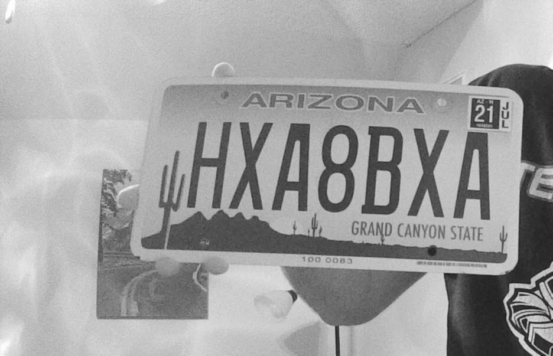

Gaussian Blur on Arizona plate. Note that the edges of the plate blends into the light background

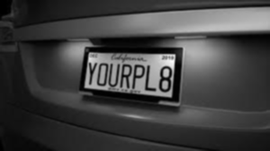

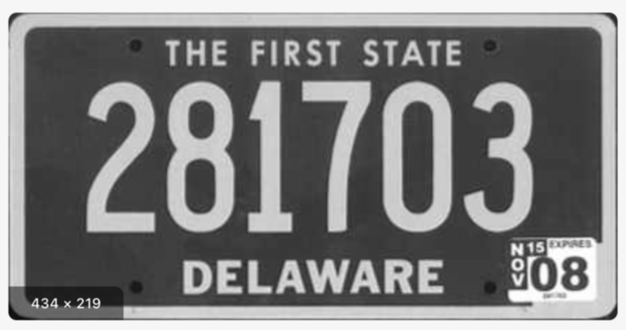

Gaussian Blur on Contrast and Delaware plate respectively. Now the contrast is sharper and edges are more defined.

This roadblock costed us significant time and was made worse in the problematic rotation problems with warping transformations. Stated before, often times the image would be rotated or flipped based on the warping function that were used. During our preprocessing phase, we had to detect contours, but the contours (good or bad) were detected and ordered in specific format depending if they are open or closed loop contours. Contour finding with ```cv::findContours``` predetermine, if it is an outer contour it should be oriented counter-clockwise, inner contours clockwise. That means the origin and top right corners would almost always be fixed but the top left and bottom right corners would often swap places. Our solution was to force a swap so no matter what kind of contour we find, it would always be a counter-clockwise contour. This illustrates how dependent the warping function is dependent on the method contours are found. Unless they are ordered specifically, it would be difficult to perform analysis upon data.

Illustration of how contours are swapped and solution:

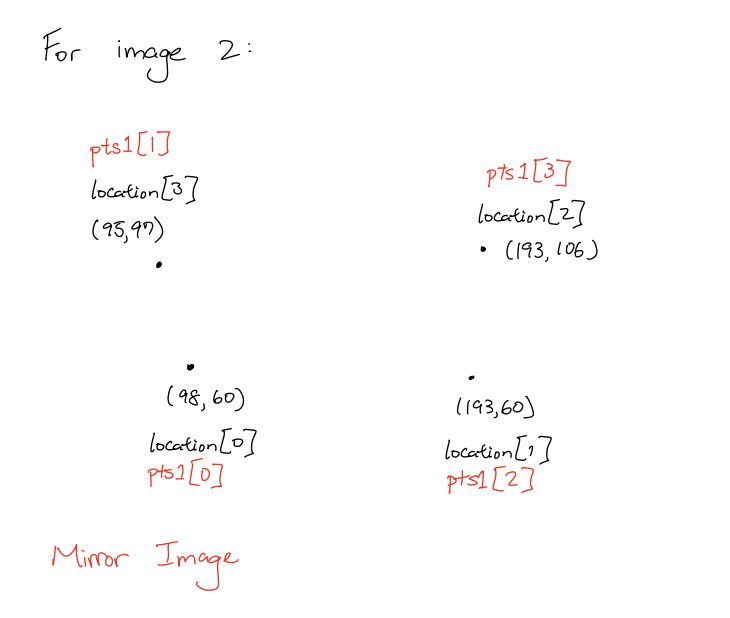

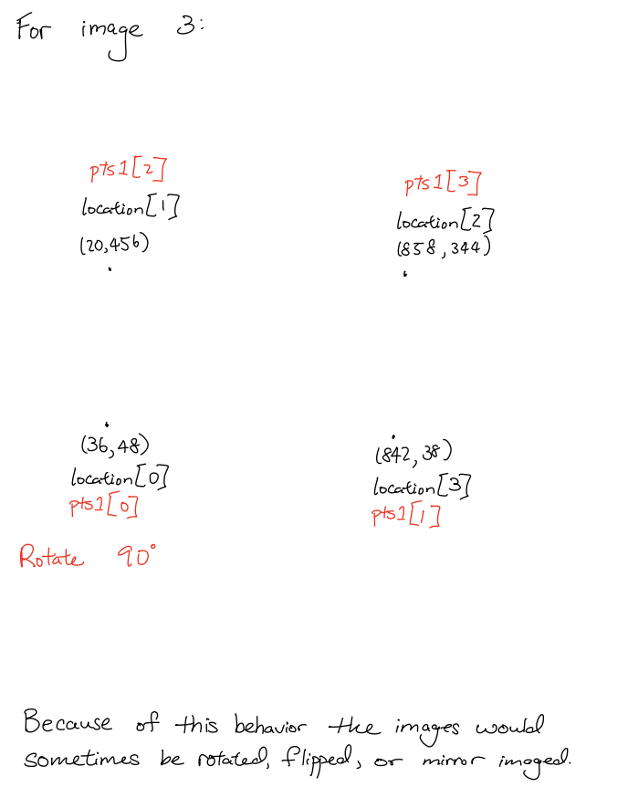

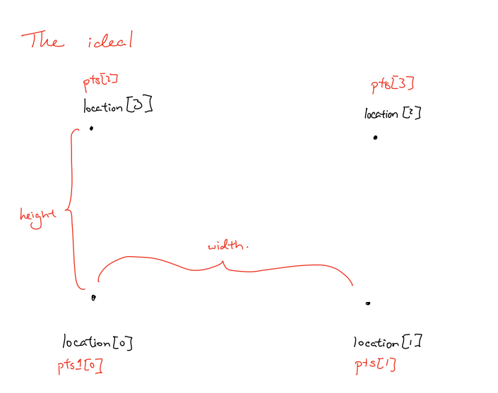

We had to implement an if-then loop that would force swap the individual x and y for each coordinate because we stored the coordinate system in a list of pointers. If we just "reorder" the list conventionally, the list would just mess up the pointers and none of the values would be correctly changed.

After the implementation of the correct coordinate system, there were some success in the image crop. Though not all of it was smooth sailing.

Greatest Contour found for Arizona Plate:

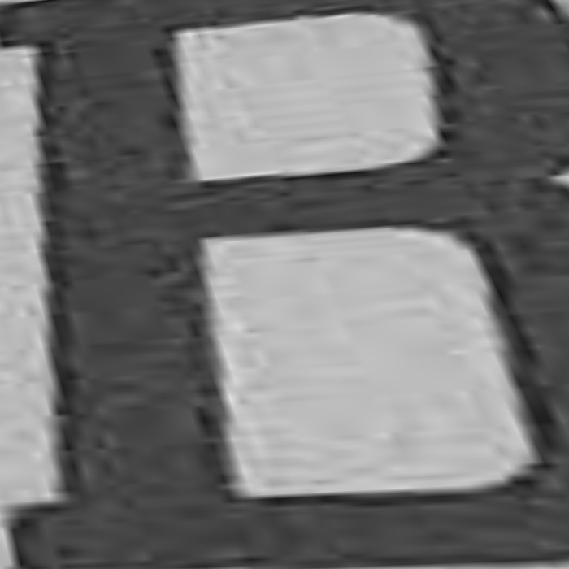

Greatest Contrast found for Arizona Plate:

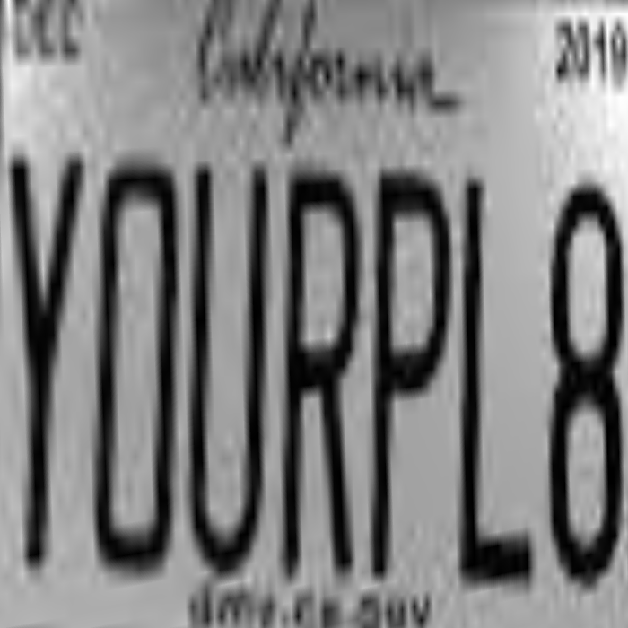

Greatest Delaware found for Arizona Plate:

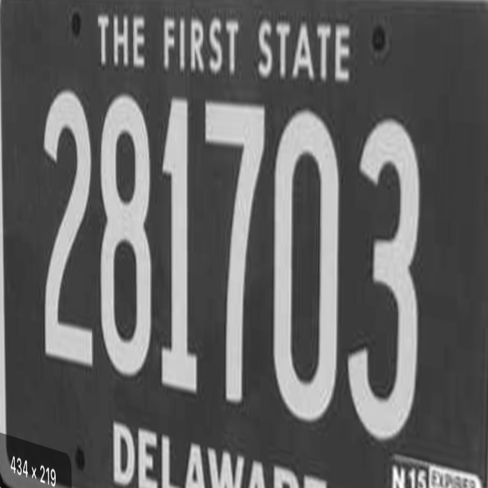

As you can see from the previous three images, the Contrast and Delaware (though a bit skewed) plates are very well cropped with clear numbers, but Arizona plate is no where close to the quality of the other two. The reason was stated previously, it was due to the choice of our blurring algorithm. It led us to blur the entire image and blend the plate into the background, since the edge of the plate had very low contrast with the light colored wall.


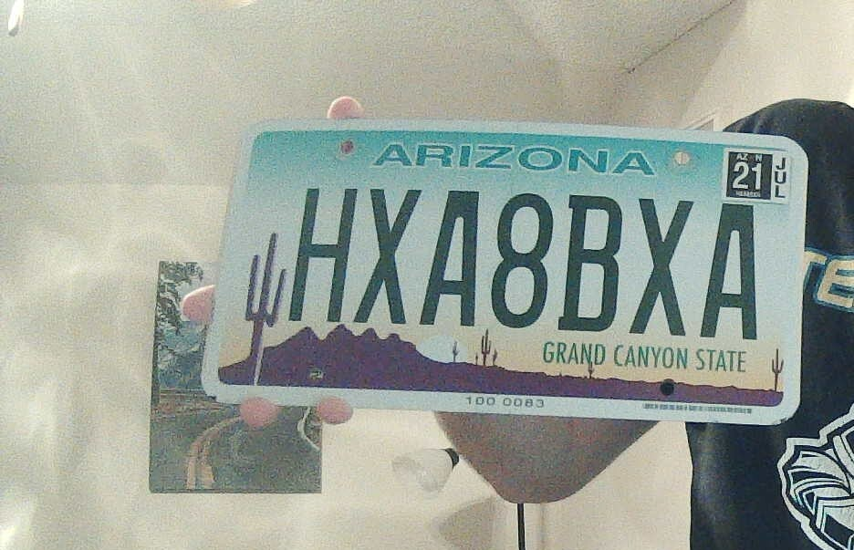


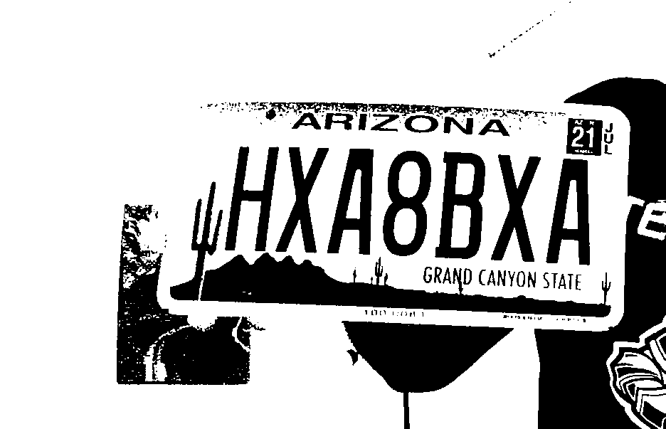

We really had three choices from there: call it and move on, manually draw a thick line around the plate for greater contrast, or use another algorithm. We tried using another algorithm but OpenCV started throwing errors about unaccessible files and so on, hence we were forced to give up. In the end we just had to move on to the other images.

Fortunately, the other images were high quality and we were able to detect text very quickly from pytesseract. But the output text were nothing of what we were expecting. No matter how we sequestered and modified the images (stretch, contrast, blur, etc), the ```pytesseract.image_to_string()``` have incredible trouble in defining readable text. We attempt whitelist of very specific characters, modified --oem and --psm. Nothing seemed to really worked. Then from lecture, we found out that the pytesseract would not work very well unless the image is completely flat. That flatness was not something we can overcome in time. We had to go back and modify the warping functions so it would impose "absolute" flatness but it did not work either. In the end we had to just let it output whatever ```pytesseract.image_to_string()``` found. Otherwise we would have zero detection rate all across. Admittedly this part is a failure, much to our chargin. However, we learned that, though powerful, pytesseract is incredibly restrained due to how the algorithm was trained. It only accepted flat images, so the ability to comprehend strings with slight angles (even by a degree or two) was compromised. We thought this algorithm would work really well with reCaptcha string detection but would suffer at real world detection without significant preprocessing alogrithms that would flatten the image before presenting it to the pytesseract.

This is a link to video of workind device: https://youtu.be/p9heWMnvzqw 