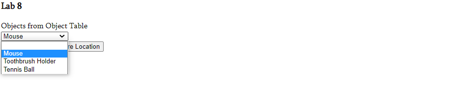
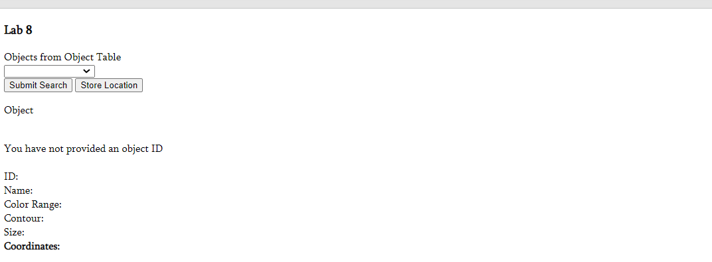
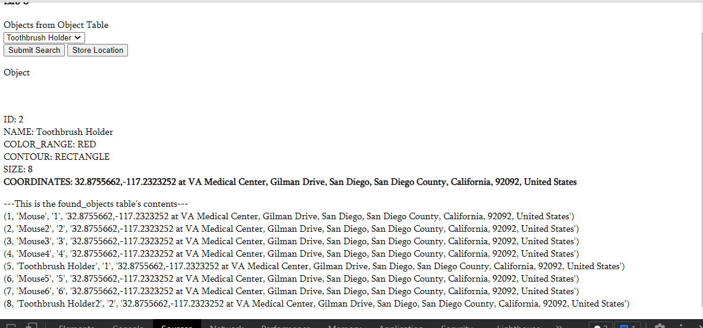
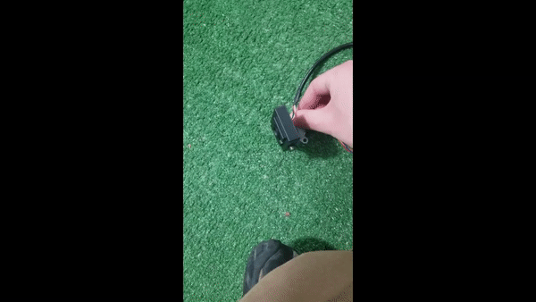
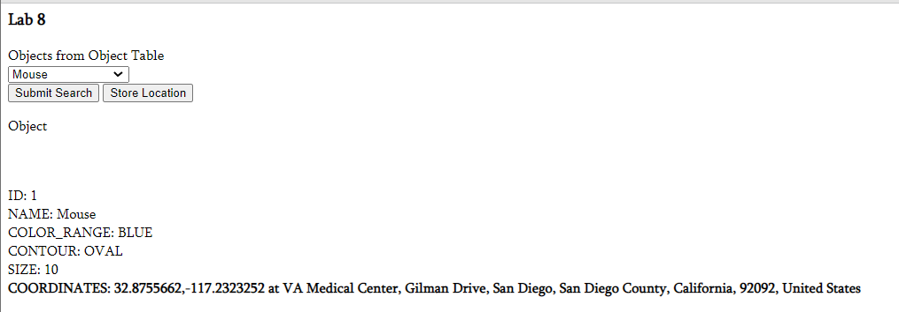

## Tutorial 1
Using CAD software, we created a mount to hold the camera. We had to extrude the central cylinder and negate the a center elpise and two off center cirlces for the motor axis and screws. We used m3 screws for the camera mount and the 3D part so the camera can move in accordance to the motor.

## Tutorial 2
Tutorial 2 we tracked the location of our raspberry pi using Global Positioning System (GPS).
We connected an IC and atenna to our raspberry pi using VCC, GND, and RX.
We accept the data into boot. We diable the /ttyserial0 port to recieve data. Then add a minicom library to analyze GPS data. Get the antenna warmed up to understand signals and get a Google Maps linked to our location. If data is gibberish run echo command. Reverse geocoding allows human readable addresses. 

## Tutorial 3
We will  be locating a red colored object to object with color segmentation. Color segmentation takes region of the image within a color range to be extracted. Largest object in color space is returned. First, filter out only the right color with HSV where inRange() gets pixels with colors in that range.
2) Do erosion then dilation to get rid of red shadows
3) IF neighbors are high then pixel takes value of label equal to lower left.
4) Get largest object while all others are false
5) Get distance from midpoint.

## Tutorial 4
Step motors send a seperate pulse for each step and con only take 1 step at a time. A motor is used to repeat the same rotations over and over. Hybrid motor type is the most used motor, and it has tooth stealed caps. Half stepping improves angle resolution. 4096 half steps in our stepper motor, taking 8.192 seconds for 1 full rotation. Use a 9v battery to create a breadboard that moves the motor and thus rotates the camera set up to it.
The larger the wait time, the longer the camera takes to move. The lower the wait time, the faster and smoother the movement is. Halving the step increment reduces the torque and makes a smoother rotation
Best values:
kp = 0.03
kd = 0.001
ki = 0.001

## Tutorial 5
When the output depends on the input, this is a closed-loop system. However there is overshoot, just like when the heater turns on in a cold room, the heater takes time to heat the already 60 degree room. We decrease overshoot by controlling the amount of output instead of a binary on/off system. For example, the heater should produce more heat at 55F than the small amount it would produce at 60F to stay at 60. Also known as proportional, integral, deivative. Rise time is time taken to go from 10% to 90%, settling time is time to reach 5% of desired error. Overshoot is max the output of system goes above output. Proportional gain changes input in proportion to error of system. Derivative gain damps to reduce overshoot and oscillations. Integral gain reduces steady state error. Reduce proportional gain to prevent oscillaion. In the code, we calculate speed control by summing gain times error values. High error means we want to have smaller step time. Delta t is the derivative of error. Sum error is area under error curve. Buffer makes sure that we are tracking more than 20 px outside senter of image. Best PID values were the same ones given initally. 10x larger made it way off same with 10x smaller.

## Challenge 1

# OUR VIDEO Link: https://drive.google.com/file/d/1EToyMqTammZyLOHuykHETUBwuNXnadvI/view?usp=sharing
# our youtube link:

Goal objects:
1) Red and rectangular
2) Blue and oval (a mouse)
3) and green sphere

We used geocashing to get the location of the object using latitude and longitude. This is done in the get_coordinates function. Please make sure to pip install geopy. We show the entire found_objects table on the webpage itself and is shown and updated when the store location button is clicked. The project requires a green tennis ball, a red toothpaste cylinder, and a blue mouse. The hardware for GPS coordinates did not work so we had to use js to get and return coordinates. You will need access to the internet for that portion. We successfuly added coordinates to webpage
and to sql found objects table along with camera paning to objects, detecting objects, create a rest route, and adding values to every new 
found object that was found and added to the table. If coordinates were not found, aka object wasn't found they were not added to found objects and it said object was not found in the table list, but rest of attributes like color and contour existed

1
We created object sql Table:

2
This is the user interface with names of objects:

This is when user does not choose an object from interface

3-5 are in the video. 3 hsv colors and other table attributes show up on
the html page here:

4 of camera move side to side:

6
This is the display gps coordinates with GEOCASHING

7
This is the store location part in found_objects and returns the contents of 
found objects when store location button is pressed

This also shows how to append a number object_name_value

