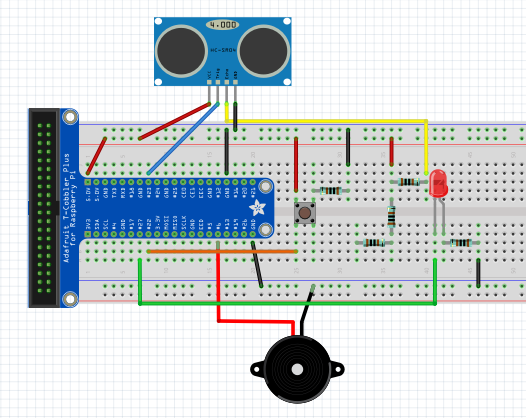
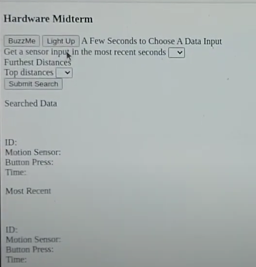

# ece-140-midterm
## Mike Liu (A15409210)

## Tutorial 1

Above gif is the Lab 5 Tutorial 3 but running on the Raspberry Pi. We had immense difficulty during the Raspberry Pi setup since we UCSD-GUEST and UCSD-PROTECTED were not viable internet to download and operate the Pi on. As a result, in the situation that we were not able to secure a working monitor and lack the ethernet connection to do so. The Tutorial had to be completed at a private network (at home). We then ssh into the Pi, enabled the VNC through ifconfig menu, and worked on the lab from there on. Using our private computers as a monitor, instead of a direct HDMI access.

## Tutorial 2
Tutorial 2 was a simple GPIO pin based device that would interface with the Raspberry Pi. The setup was reminiscent of an Arduino setup, complete with a Python script that receives input and sends output to the desired pins. Here a simple distance gauge was made with a HC-SR04 ultrasonic sensor to judge a distance, then beyond a distance threshold a buzzer (alarm) would ring. A piece of code to note is GPIO.cleanup(). If this code was not included, the Raspberry Pi can easily malfuction and break because of conflicting signals at setup. .cleanup() "cleans" or reset all of the GPIO pins to their standard state to avoid multiple signals going through or throwing a high when it's not supposed to and overload the circuit, thus breaking the Pi.

## Challenge 1/ Midterm
#### Summary

Above is our Lab 6 Schematic, it is an extension of the Tutorial 2 schematic with addition of a working LED and Buzzer (replaced by Piezzo Speaker in Schematic). For this Challenge we have three main file catagories working together in conjunction: website, database, and raspberry pi.

#### Purpose of each File
Website file(s) are the following: ```./public/rest.js``` ; ```index.html``` ;  ```app.py```.
 Website files handles all execution of starting and maintaining the website. At the base level, when we run ```app.py``` it is suppose to create a website in the format specified in ```index.html``` and specific functions for pressing buttons or dropdown menus are specified in ```./public/rest.js```. 

Database file(s) are the following: ```init_db.py``` ; ```credentials.env``` (the .env files that hold your MYSQL credentials)
The Database files are suppose to initiate the MYSQL database from the format specified in ```init_db.py```. But in order to access the MYSQL without manually creating one on the command prompt, ```init_db.py``` also automatically signs into the host's MYSQL from the credentials from ```credentials.env```. Data streams will be updated to the MYSQL tables (in Raspberry Pi it uses Mariadb) which certain functions depend on the data points to carry out their functions. Specific use and pulling of MYSQL data will happen in ```app.py```

Raspberry Pi file(s) are the following: ```getSonar.py```
The Raspberry Pi file(s) are the references and functions that will directly interact with the GPIO pins on the Raspberry Pi. ```getSonar.py``` is written with function defs that will carry out processes such as, turning on and off LED, turning and off buzzer, gather sensor data from ultrasonic sensor and button, and populate the corresponding data to the MYSQL table. 

#### How to Test
In order to test our project, you must load all of the files in ```./Midterm/``` to your coding enviornment in the Raspberry Pi. Some libraries may need to be installed on a new Raspberry Pi, all libraries were used in prior labs, and MYSQL must be installed on the Pi. If MYSQL is not yet intalled on the Pi with Mariadb, please refer to [Tutorial 1: Setup Raspberry Pi](https://docs.google.com/document/d/1dpmIBfNe_0GEucv2xybTPxQJdKOX5EFjvQsj6BtVsFU/edit) and carry out instructions from there. Also if there is preferred IDE please install it as well.

Once setup for the Raspberry Pi, MYSQL, and IDE is complete, the next task is to test whether the circuit is functioning properly. Please use the following schematic to wire the Raspberry Pi

Please note the GPIO pins that are specified in ```getSonar.py``` and wire according to the pin numbers:
``` python
buttonPin = 22
trigPin = 23
echoPin = 24
buzzerPin = 6
LED_PIN = 17
```
. If you have other GPIO pin preferences please change your pins ```getSonar.py```.
Now, run getSonar.py and open the console. There should be an incoming data stream from the button state and ultrasonic sensor in the console. Try pressing the button and change the distance (of your hand) to the ultrasonic  sensor, the changes should be reflected on the datastream. If you decrease the distance to 0 on the ultrasonic sensor, the buzzer should start to sound. Something to note: if you don't want the buzzer to sound endlessly after 30 seconds, make sure the ultrasonic sensor is unobstructed as we only collect 30 seconds worth of data.
If the ultrasonic sensor, button, and buzzer all work as described above, then that means the zero distance sensor is working properly. 

Next, Ctrl+C on the console to kill ```getSonar.py``` to test the interactive website. Once ```getSonar.py``` has ended properly, run ```app.py```. You should see a line in the command console that says
```
Web server started on: http://0.0.0.0:6543
```
and a datastream output similar to when you ran ```getSonar.py```. This is because ```app.py``` is the script that sets up the website and allow for device interaction through ```getSonar.py``` reference. So, open Chromium (Web Browser), on the search bar type in ```localhost:6543```. A website that looks like this will appear.

Try clicking on ```BuzzMe``` and ```Light up``` buttons. It will turn on the buzzer or LED, depending on which button you press. Now the two drop down menus will sort your collected data from MYSQL database when you ran ```app.py``` on the specified parameters listed on the website. Click ```Submit Search``` and the desired search result will be displayed below in:
```
ID:
Motion Sensor:
Button Press:
Time:
```
You can also have both drop down menus active at the same time to get a search result. Try messing around with it.
If you want to end the website, go to the console and CTRL+C like you did in ```getSonar.py```. This will ensure that the GPIO pins are freed correctly and will not cause a malfunction in the Pi with conflicting states.

#### Possible Errors
- "MYSQL_HOST" none error
This error is typically caused by incorrect credentials to your MYSQL database. Our script loads a .env file with very certain parameters of username, password, host, and database name. So the ```credentials.env``` we uploaded WILL NOT WORK FOR YOU. Please make your own with the formated provdied by ```credentials.env```, that is why we provided the file. And name YOUR FILE ```.env```. 
- No module named '<module name here>'
Most likely you have not installed a library that you were supposed to. Please check on the start of each file and see if you have installed all of the pre-installed imported libraries.

Demonstration to the the Raspberry Pi device:
https://youtu.be/KNaq1svNrok
